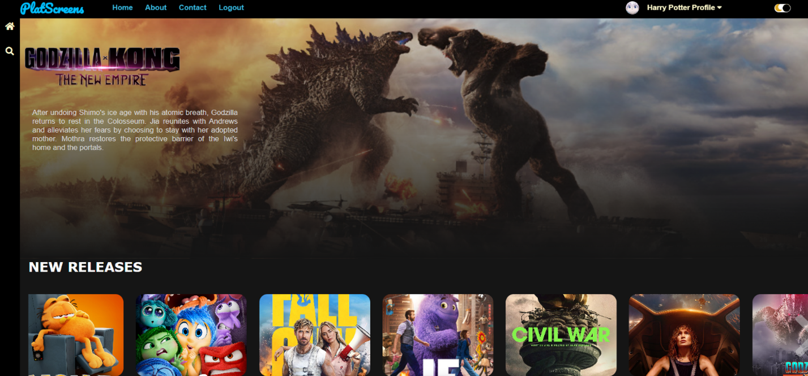

# PlatScreens - Movie Ticket Booking Web

## Project Overview

PlatScreens is a Movie Ticket Booking web designed for PlatScreens cinema. The system allows users to browse movies, book seats, manage their bookings, and enables administrators to manage movie listings and view booking records. This project is built with PHP, MySQL, JavaScript, and  integrates with AWS cloud services.

## Features

### User Features
- **User Authentication**: Secure registration and login system with password hashing
- **Movie Browsing**: View currently showing and upcoming movies with detailed information
- **Seat Booking**: Interactive seat selection interface for multiple cinema locations
- **Payment Checkout**: Support for Online Bank Transfer, PayPal, and Touch-N-Go
- **Download Recepit**: Download receipt in pdf file
- **Booking History**: View past and current bookings with invoice details
- **User Profile Management**: Update profile information and change password
- **Search Movie**: Search for movies by title or description
- **Contact & Support**: Customer service form for inquiries and support

### Admin Features (Admin Dashboard)
- **User Authentication**: Secure registration and login system with password hashing
- **Movie Management**: Add, edit, and delete movie listings
- **Booking Management**: View all booking records 
 
### Technical Features
- **AWS Integration**: Uses AWS EC2, RDS (MariaDB), S3, and AWS Secrets Manager
- **Session Management**: Secure user session handling
- **Responsive Design**: Mobile-friendly interface
- **Real-time Seat Status**: Dynamic seat availability updates
- **Invoice Generation**: Automatic invoice creation for bookings

## Usage
*Refer to `WebsiteFunctionalities.pdf` for detailed instructions.*

### For Users

1. **Registration/Login**
   - Navigate to the login page
   - Create a new account or login with existing credentials

2. **Browse Movies**
   - View featured movies on the homepage
   - Click on movie posters for detailed information

3. **Book Tickets**
   - Select a movie
   - Choose location, date, and time
   - Select available seats on the interactive seat map
   - Proceed to payment
   - Choose payment method and complete booking
   - Download/print receipt

4. **Manage Profile**
   - Update personal information
   - Change password
   - View booking history

### For Administrators

1. **Admin Login**
   - Access admin panel at `/admin/admin/login.php`
   - Default credentials:
     - Username: `admin1` / Password: `admin1`
     - Username: `admin2` / Password: `admin2`

2. **Manage Movies**
   - Add new movies with complete details
   - Edit existing movie information
   - Delete movies that are no longer showing
   - Upload cover images and background images

3. **View Bookings**
   - Access booking records


## Project Structure

```
book_movie_web/
├── index.php                    # Root redirect to homepage
├── global.php                   # Global configuration and database connection
├── theater_db.sql               # Database schema and sample data
│
├── homepage/                    # Main landing page
│   ├── index.php
│   ├── index.css
│   ├── app.js
│   └── set_movie.php
│
├── login/                       # Authentication module
│   ├── login.php
│   ├── register.php
│   ├── logout.php
│   ├── change_password.php
│   └── log_in.css
│
├── movie_details/               # Movie information page
│   ├── movie-details.php
│   └── movie_details.css
│
├── booking_seat/                # Seat booking system
│   ├── book_seat.php
│   ├── book_seat.js
│   ├── book_seat.css
│   ├── fetch_seat_status.php
│   ├── generateSeatStatus.php
│   ├── update_seat_status.php
│   ├── payment_info.php
│   ├── receipt.php
│   ├── bank-demo.php
│   ├── paypal-demo.php
│   └── touch-n-go-demo.php
│
├── view_history/                # Booking history
│   ├── booking_history.php
│   └── booking_history.css
│
├── user_profile/                # User profile management
│   ├── edit_profile.php
│   ├── update_profile.php
│   ├── change_password.php
│   └── edit_profile.css
│
├── searching/                   # Search functionality
│   ├── search.php
│   ├── search_results.php
│   └── index.php
│
├── about_us/                    # About Us page
│   ├── about_us.php
│   └── about_us.css
│
├── contact_us/                  # Customer service
│   ├── CustomerServiceForm.php
│   └── CustomerServiceForm_Style.css
│
├── navbar/                      # Navigation component
│   ├── navbar.php
│   └── navbar.css
│
├── admin/                       # Admin panel
│   └── admin/
│       ├── index.php
│       ├── login.php
│       ├── manage_movie.php
│       ├── manage_seat.php
│       ├── movielist.php
│       ├── book.php
│       ├── admin_class.php
│       ├── ajax.php
│       ├── header.php
│       ├── navbar.php
│       ├── topbar.php
│       └── assets/              # Admin panel assets (CSS, JS, fonts)
│
└── aws/                         # AWS integration
    └── getAppParameters.php     # AWS Secrets Manager integration
```

## Database Schema

The application uses MariaDB/MySQL with the following main tables:

### `users`
Stores user account information with hashed passwords.

### `admins`
Stores administrator credentials for the admin panel.

### `movies`
Contains movie information including:
- Title, description, duration
- Cover image, background image
- Genre, classification, language
- Director, cast, release date
- Trailer YouTube link
- Showing dates (start and end)

### `booking_info`
Records all bookings with:
- Invoice ID (unique identifier)
- User details (name, phone, email)
- Movie details (ID, title)
- Show details (location, date, time)
- Seat numbers
- Payment information (amount, method)

### `seat_status`
Tracks seat availability:
- Seat ID
- Movie ID
- Location
- Show date and time
- Status (available/sold)

## Technology Stack

### Frontend
- **HTML5/CSS**: Structure and styling
- **JavaScript**: Interactive features and AJAX requests

### Backend
- **PHP**: Server-side logic
- **MySQL/MariaDB**: Database management
- **Sessions**: User authentication and state management

### Cloud Services (AWS)
- **EC2**: Application hosting
- **RDS**: Database hosting (MariaDB)
- **S3**: Static file storage (images, assets)
- **Secrets Manager**: Secure credential storage
- **AWS SDK for PHP**: Cloud service integration

### Libraries & Frameworks
- **jQuery**: DOM manipulation and AJAX
- **DataTables**: Admin panel table management
- **Bootstrap**: Admin panel responsive design
- **Select2**: Enhanced select dropdowns
- **Animate.css**: CSS animations


## AWS Cloud Architecture Design


This AWS cloud architecture diagram illustrates a high-availability setup for a movie booking web application. The system is deployed within a custom VPC (10.0.0.0/16) spanning two Availability Zones, each containing public and private subnets. Public subnets host NAT Gateways to enable outbound internet access for private resources, while private subnets host EC2 instances and RDS databases.

**Key components include:**

* An Internet Gateway connected to an Application Load Balancer, which distributes incoming traffic to EC2 instances running in private subnets across both Availability Zones.
* NAT Gateways that allow resources in private subnets to access the internet for updates and external services while preventing direct inbound internet access.
* EC2 instances deployed in private subnets (10.0.2.0/24 and 10.0.4.0/24), managed by an Auto Scaling group to dynamically scale based on application load.
* Amazon RDS database instances hosted in private subnets (10.0.5.0/24 and 10.0.6.0/24) with a primary and standby configuration for high availability and redundancy.
* Security groups applied to EC2 instances and databases to enforce least-privilege access control.
* AWS Secrets Manager for secure storage of application credentials and configuration parameters.
* An Amazon S3 bucket for static asset storage, accessed securely via IAM roles.

This architecture emphasizes security, scalability, and fault tolerance through network isolation, controlled access, and multi-AZ deployment.


## Cloud Deployment Steps Overview (AWS)
*Refer to `CloudDeployGuide.pdf` for detailed instructions.*
### 1. Network & Infrastructure Setup

- Create a custom VPC (10.0.0.0/16) with public and private subnets across multiple Availability Zones.
- Attach an Internet Gateway for public access.
- Deploy NAT Gateways in public subnets to allow outbound internet access from private instances.
- Configure route tables to manage traffic between public and private subnets.
- Create security groups to allow HTTP/HTTPS traffic, SSH for development, and MySQL access for database instances.
- Use public subnets for direct access during development and testing, while private subnets are used in production for enhanced security, scalability, and reliability.

---

### 2. Compute & Security Configuration (EC2 Instance Setup)

- Launch an EC2 instance with Amazon Linux 2023 (t3.2xlarge).
- Configure security groups to allow SSH (22), HTTP (80), and MySQL (3306) traffic.
- Attach an IAM role with permissions for Secrets Manager, S3, and EC2 metadata.
- Allocate and associate an Elastic IP for static addressing.

---

### 3. Application & Environment Setup

- Integrate AWS Secrets Manager to securely store environment variables.
- Refactor the web application code to support dynamic image URLs (S3).
- Use SSH to connect to the EC2 instance and upload the website's source code.
- Install required packages on the EC2 instance (Apache, PHP, MySQLi, and MariaDB).
- Create Secrets Manager variables for local database credentials:
   - `/cafe/dbUrl` - localhost endpoint URL
   - `/cafe/dbName` - Database name (`theater_db`)
   - `/cafe/dbUser` - Database user (`root`)
   - `/cafe/dbPassword` - Database password
   - `/cafe/s3Url` - EC2 IP
- Set up and initialize the **local** MariaDB database on the EC2 instance using the SQL dump (sample data).
- Test the web application on the EC2 instance.

---

### 4. Decoupling Storage & Database (Migrate Database from EC2 to RDS)

- **RDS Database Setup**
    - Create an RDS instance (MariaDB) using the Production template, which automatically enables Multi-AZ deployment for high availability.
      - Multi-AZ means AWS provisions a primary instance and a synchronous standby in another Availability Zone.
    - Create a DB subnet group with 2 private subnets (Private subnet 3 & Private subnet 4) across 2 Availability Zones (ap-southeast-1a & ap-southeast-1b) for high availability.
    - Attach a security group that allows MySQL access only from the EC2 instance.

- **S3 Bucket Setup**
    - Create an S3 bucket with a unique name for static assets.
    - Configure the bucket policy for public read access.
    - Upload movie images and static files to the `/images` folder.
    - Store the S3 URL in Secrets Manager (`/cafe/s3Url`).

- **Update Secrets Manager and Migrate the Database**
    - Use SSH to connect to the EC2 instance
    - Update Secrets Manager variables:
       - `/cafe/dbUrl` - RDS endpoint URL
       - `/cafe/dbName` - Database name (`theater_db`)
       - `/cafe/dbUser` - Database user (`admin`)
       - `/cafe/dbPassword` - Database password
       - `/cafe/s3Url` - S3 bucket URL
    - Import the database dump (theater_db.sql) into RDS from the EC2 instance
    - Remove the local database after successful migration.
    - Test the web application again.

---

### 5. High Availability & Scalability

- **Application Load Balancer**:
   - Create an ALB across multiple Availability Zones.
   - Configure a target group with health checks (`/homepage/index.php`).
   - Attach a security group for HTTP/HTTPS traffic.

- **Auto Scaling Group**:
   - Create an AMI from the configured EC2 instance.
   - Set up a launch template with the AMI and instance configuration.
   - Deploy an Auto Scaling Group in private subnets.
   - Configure a scaling policy (target tracking at 50% CPU utilization).
   - Set capacity: Min 1, Desired 2, Max 4 instances.

- **NAT Gateway**:
   - Enable internet access for private subnet instances.

---

### 6. Testing & Verification

- Access the application via the ALB DNS name.
- Test user features: registration, booking, payments, and profile management.
- Test admin features: movie management and booking overview.
- Verify high availability by terminating instances and observing recovery.
- Validate auto-scaling under load conditions.
- Confirm security: RDS private access and Secrets Manager integration.


